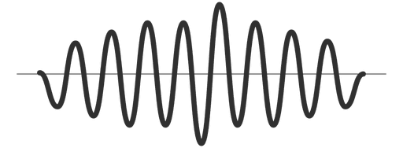
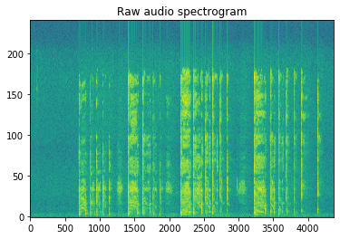
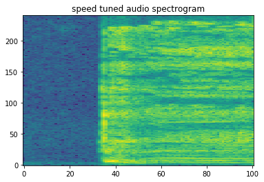
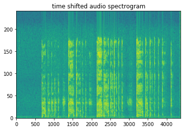

<p align="center">
  
</p>
<h2 align="center">Cough Signal Processing ( csp ) </h2>


<p align="center">A micro framework for cough singal processing </p>
<p align="center"> Contribute and Support </p>


[](https://github.com/coughresearch/Cough-signal-processing/blob/master/LICENSE)
[](https://github.com/coughresearch/Cough-signal-processing/commits/master)
[](http://makeapullrequest.com)

### Features

- Spectrogram features extraction
- Contiguous features
- Cough event detection
- Experiments on noise removal, Silence in cough sounds
- Applying different types of filters
- Audio augmentation techniques


| Feature ID    | Feature Name  | Description  |
| :-------------: |:-------------:|-----|
| 1 | Zero Crossing Rate      |  The rate of sign-changes of the signal during the duration of a particular frame.  |
| 2 | Energy | The sum of squares of the signal values, normalized by the respective frame length. | 
| 3 | Entropy of Energy | The entropy of sub-frames' normalized energies. It can be interpreted as a measure of abrupt changes. | 
| 4 | Bispectrum Score (BGS) | 3rd order spectrum of the signal is known as the bispectrum.| 
| 5 | Non-gaussianity score(NGS) | NGS gives the measure of non-gaussianity of a given segment of data. | 
| 6 | Formant frequencies (FF) | A formant is the spectral shaping that results from an acoustic resonance of the human vocal tract. |
| 7 | log energy (LogE) | The log energy for every subsegment |
| 8 | kurtosis (Kurt) | kurtosis is a measure of the "tailedness" of the probability distribution of a real-valued random variable. |
| 9 | MFCCs | Mel Frequency Cepstral Coefficients form a cepstral representation where the frequency bands are not linear but distributed according to the mel-scale. |
 10 | MFCC delta, delta2 | Delta-MFCC and Delta-Delta-MFCC are used to extract the features of speakers. |
| 11 | Skewness | skewness is a measure of the asymmetry of the probability distribution |
| 12 | Power Spectral Density (PSD) | A Power Spectral Density (PSD) is the measure of signal's power content versus frequency. |
| 13 | Linear Predictive Coding (LPC) | Representing the spectral envelope of a digital signal of speech in compressed form |
| 14 | Continuous Wavelet Transform (CWT) | provides an overcomplete representation of a signal by letting the translation and scale parameter of the wavelets vary continuously. |


 ## More features and suggestions are welcome.


### Quick Start

```python
from csp import SpectrogramFeatures

# path of the cough audio
sp   = SpectrogramFeatures('cough_sound_9412.m4a')
data = sp.spectrogram_data()

```

#### output




### Audio augmentation techniques
#### Speed tuning

```python
from csp import AudioAugmentation

# Audio_augmentation speed tuning
Audio_aug = AudioAugmentation.speed_tuning(data['signal'])

```

#### output




#### Time shifting
```python

# Audio augmentation time shifting
aug = AudioAugmentation.time_shifting(data['signal'])

```

#### output




#### Feature extraction { @thileepanp }
<p align="center">
  
</p>
